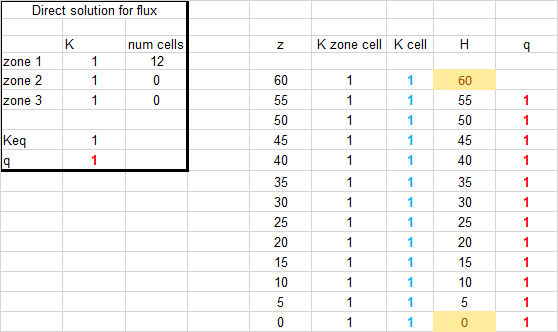
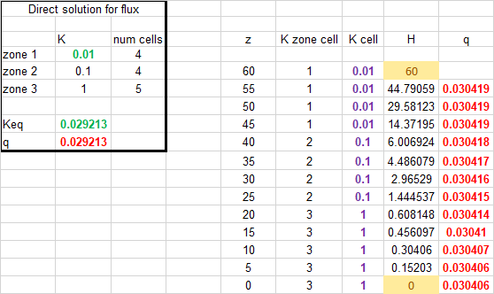
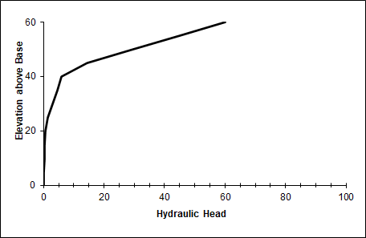

# HW 1 Challenge and Discussion Questions
## Gillian Noonan

**Challenge:**

*1) Show, based on the flux with depth, that the model is steady state. Repeat this for a homogeneous and for a heterogeneous column.*

>Answer: For steady state conditions, the flux should not change with depth, but should stay constant, or steady.   This would be symbolized by a constant flux value across all elevations, or over the entire column, which is seen as a straight vertical line in the elevation vs. flux plot (Fig.1 and Fig.2).

Fig 1. Homogenous column:

Fig 2. Heterogeneous column:

*2) Show that the steady state flux agrees with the direct calculation based on the harmonic mean average K. Write the equation defining the direct calculation of the flux.*

>Answer: The steady state flux for each of the homogeneous and heterogeneous cases equals the direction calculation using the harmonic mean average K (Fig.3 and Fig.4). The formula for direct calculation of the flux is:

        q = Keq (dH/dz)
Fig. 3

Fig.4

*3) Show the steady state head profile for a column with approximately equal-thickness layers that have different K values. Use the head profile to explain WHY the equivalent hydraulic conductivity, Keq, is closer to the lower of the two K values.*

>Answer: Fig.5 shows the steady state head profile (elevation vs. head) for the heterogeneous column.  The layers have near-equal thickness with K values of 0.01, 0.1, and 1.   The Keq value is given as 0.03.   This is closest to the lowest of the three K values.   I am speculating here, but the lower hydraulic conductivity is present in 4 cells out of 13 - the range of the head change dH/dl has the highest gradient over these cells, when compared to the higher conductivity cells. Maybe this is a factor?

Fig.5

**Discussion - Initial Thoughts**

  - *What are boundary conditions? Answer this both conceptually and mathematically.*
>Answer:  Boundary conditions are settings entered into a model that specify values that are set in stone for the edges of the model.  They constrain the model at the edges (or boundaries).

  - *What are model parameters? How do they (and don't they) represent the actual subsurface?*
>Answer: Model parameters are directions that guide the code toward a solution. They can be assumptions that are made for a model based on a-priori knowledge of a site (geology, structure, etc.).  Or they can be restrictions on how you want the model to run - how many iterations, how much freedom of deviation from starting model, etc.

  - *What are steady state conditions and how can they be identified from the Excel model results?*
>Answer: Steady state conditions indicate that flow does not change over time from point over the column.   this can be identified in the Excel model by the elevation versus flux plot - flux stays constant with changing elevation.

  - *Can you imagine how the model inputs could be stored in separate files rather than other spreadsheet cells?  Describe the flow of information from a file that describes the other files that contain model-specific information about the system.*
>Answer: Yes i could imagine this, columns or cells could be contained within seperate files that are read in to the model.  This would be a model input file or files (files that contain information to guide the model).

  - *What is an iterative solution? Can you explain it to a hydrologist who is not a modeler? Can you describe (or imagine) how Excel finds the solution?*
>Answer: An iterative solution is a solution to a problem that calculates over many trials, with each trial getting closer to a converging solution for a best real world approximation (model result).  Excel probably calculates an error value for each trial and continues to iterate until that number becomes significantly small.

  - *What is a direct solution? What are its (dis)advantages compared to an iterative (numerical) solution?*
>Answer: Not exactly sure of this one, but i would guess that a direct solution is achieved by using direct means such as a calculation with known values for a known location.  As opposed to iterative modeling where you are taking some assumptions or sparse measurements to create a valid "guesstimate" or extrapolation over a large area?
