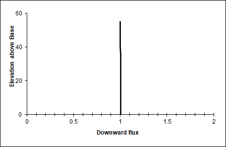
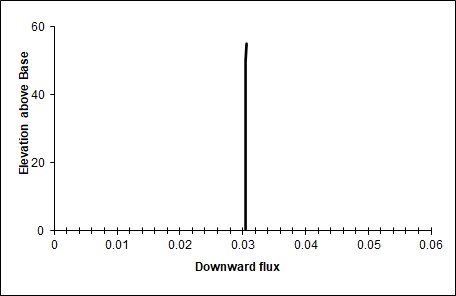
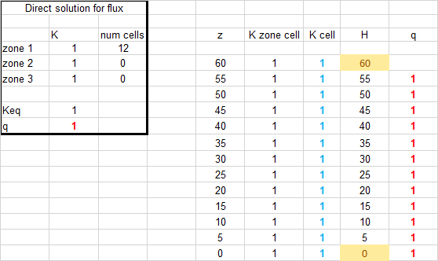
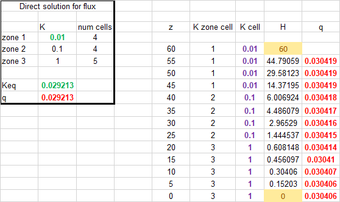
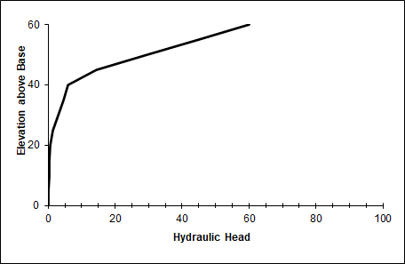

# HW 1 Challenge and Discussion Questions
## Gillian Noonan

**Challenge:**

*1) Show, based on the flux with depth, that the model is steady state. Repeat this for a homogeneous and for a heterogeneous column.*

>Answer: For the steady state conditions in this column of constant cross-sectional area, the flux should not change with depth, but should stay constant, or steady.  Flux must be the same into and out of each cell in the system. This would be symbolized by a constant flux value across all elevations, or over the entire column, which is seen as a straight vertical line in the elevation vs. flux plot (Fig.1 and Fig.2).

Fig 1. Homogenous column (elevation vs. flux):

Fig 2. Heterogeneous column (elevation vs. flux):

*2) Show that the steady state flux agrees with the direct calculation based on the harmonic mean average K. Write the equation defining the direct calculation of the flux.*

>Answer: The steady state modeled flux for each of the homogeneous and heterogeneous cases equals (fairly closely) the direct calculation using the harmonic mean average K (Fig.3 and Fig.4).  The formula for direct calculation of the flux is:

        q = Keq (dH/dz)

**note my heterogenous model does not consider the edges of the model at the center of the cells in this calculation but instead extends to the edges of the cells.  This is in error and is noted as such based on the lecture of 1/19.**

Fig. 3 Homogenous case model - modeled flux vs. direct calculation using Keq

Fig.4 Heterogenous case model - modeled flux vs. direct calculation using Keq

*3) Show the steady state head profile for a column with approximately equal-thickness layers that have different K values. Use the head profile to explain WHY the equivalent hydraulic conductivity, Keq, is closer to the lower of the two K values.*

>Answer: Fig.5 shows the steady state head profile (elevation vs. head) for the heterogeneous column.  The layers have near-equal thickness with K values of 0.01, 0.1, and 1.   The Keq value is given as 0.03.   This is closest to the lowest of the three K values.   I am speculating here, but the lower hydraulic conductivity is present in 4 cells out of 13 - the range of the head change dH/dl has the highest gradient over these cells, when compared to the higher conductivity cells. Maybe this is a factor?

> **From lecture discussion:** it has to do with energy.   From Darcy: we know that we have a certain amount of energy to dispel through a system.   Here we are requiring same flow through whole system.  If you use up a lot of energy in the low K system trying to flow through, there is less energy left for flow through the high K system.  
The energy is related to the square of the gradient.  The energy loss is even larger in that low k medium that has to have a higher gradient.  
"The system is most sensitive where the most energy is lost".  In our system setup we are forcing the energy through the low K system where it is losing a lot of energy.

Fig.5

**Discussion - Initial Thoughts**

  - *What are boundary conditions? Answer this both conceptually and mathematically.*
>Answer:  **copied from the notes directly because I wrote them!**  
>- A boundary designates the edges of your isolated portion of the “universe”, nothing outside the system matters.  Only way it influences your system is through the boundary conditions.
>-Boundary conditions are settings entered into a model that specify values that are set in stone for the edges of the model.  
>-They constrain the model at the edges (or boundaries).  While the interior cells of the model can change, the model must meet these edge conditions.
>-Describes either value of primary variable or gradient perpendicular to the boundary of that primary variable
>> - Type 1: Fixed or defined head
>> - Type 2: Gradient
>> - Type 3: Mixed
>-These values define every influence the rest of the world has within your domain
>-Can be a constant head boundary or a designated flux at the boundary
>-If the set value is way off from real-world, the model can be greatly affected
>-How representative a model is  of a system is influenced by chosen boundary conditions.
>-Hard to define:  Often end up figuring out good values for boundary actually through modeling - based on an inferred starting boundary.
>-Give a buffer zone to edges of model (outside of survey zone) to make sure to include full survey zone to reduce loss from the model cells being in the center

  - *What are model parameters? How do they (and don't they) represent the actual subsurface?*
>Answer: Model parameters are directions that guide the code toward a solution. They can be assumptions that are made for a model based on a-priori knowledge of a site (geology, structure, etc.).  Or they can be restrictions on how you want the model to run - how many iterations, how much freedom of deviation from starting model, etc.

  - *What are steady state conditions and how can they be identified from the Excel model results?*
>Answer: Steady state conditions indicate that flow does not change over time from point over the column, and when the cross-sectional area is constant, flux also doesn't change over time.   this can be identified in the Excel model by the elevation versus flux plot - flux stays constant with changing elevation.

  - *Can you imagine how the model inputs could be stored in separate files rather than other spreadsheet cells?  Describe the flow of information from a file that describes the other files that contain model-specific information about the system.*
>Answer: Yes i could imagine this, columns or cells could be contained within separate files that are read in to the model.  This would be a model input file or files (files that contain information to guide the model).

  - *What is an iterative solution? Can you explain it to a hydrologist who is not a modeler? Can you describe (or imagine) how Excel finds the solution?*
>Answer: An iterative solution is a solution to a problem that calculates over many trials, with each trial getting closer to a converging solution for a best real world approximation (model result).  Excel calculates a tolerance for each trial and continues to iterate until that number becomes significantly small or until you tell it to stop (based on your time constraints or set # of iterations requirements).

  - *What is a direct solution? What are its (dis)advantages compared to an iterative (numerical) solution?*
> Answer:
> - A direct or analytical solution is achieved by using direct means such as a calculation with known values for a known location.  Upside: Fast and computationally efficient, especially for transient processes.  Downside: usually only works for very simple and specific conditions.  Good first test of a model.
> - As opposed to iterative modeling where you would need to model over many time stamps to get to the final result of a model.
