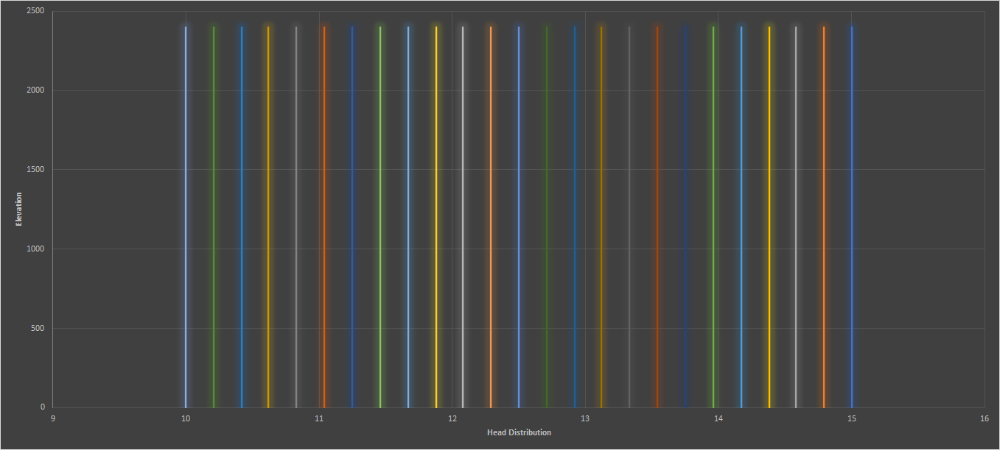
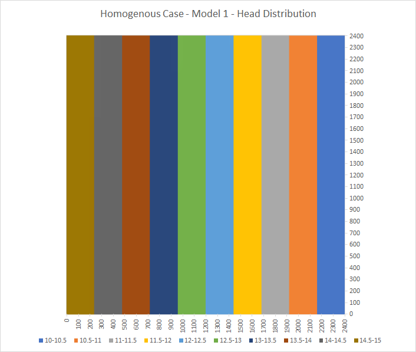
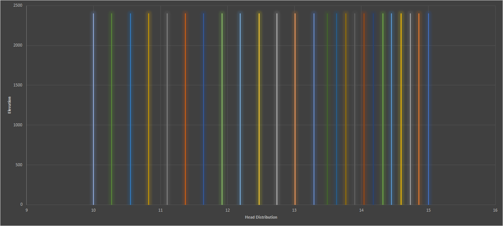
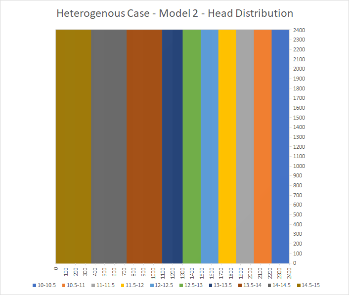
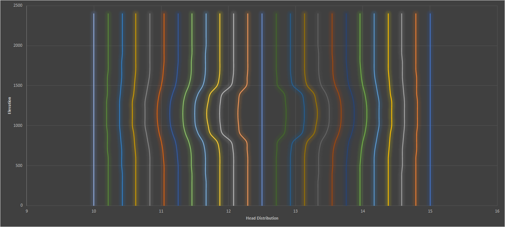
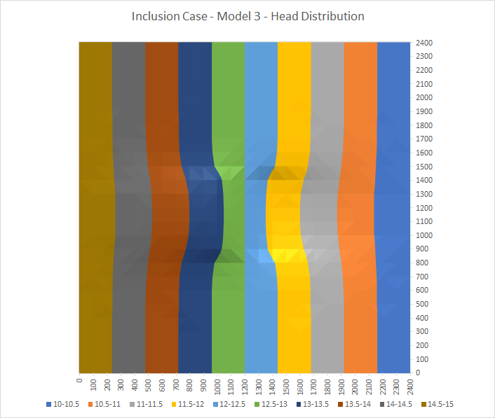
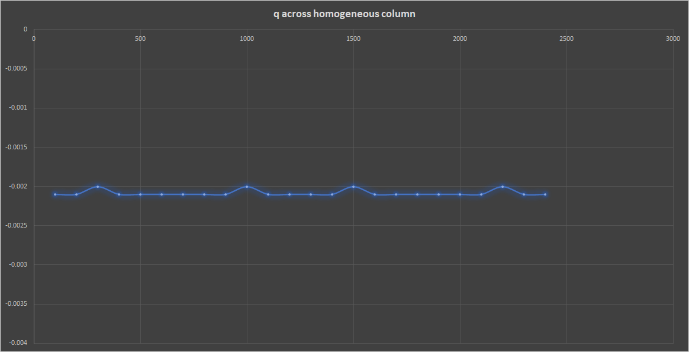
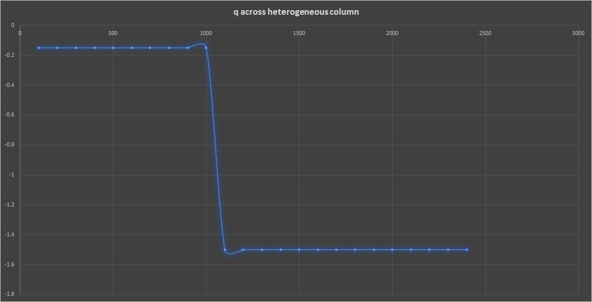
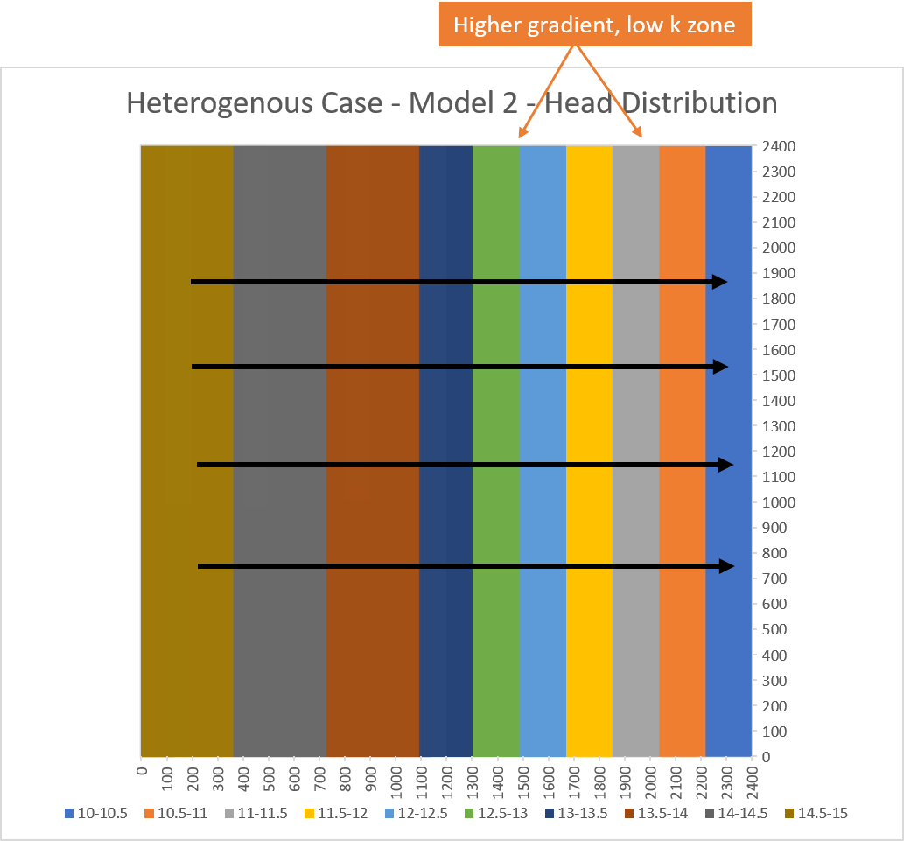
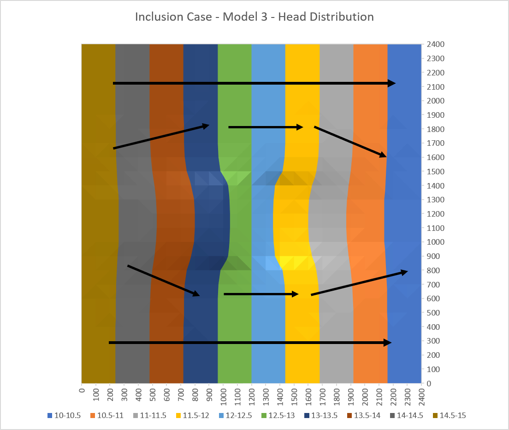

## Gillian Noonan
## HW 2 Challenge and Discussion Questions, Box Model- Hand-Built MODFLOW

## **Challenge:**
MODFLOW files have been supplied that model steady state saturated flow through a 3D system.  The layers are flat lying.  The top and bottom faces and two opposite vertical boundaries are no-flow.  Each of the other two faces has a constant head applied to each.

​The model is set up for a homogeneous medium.  You will have to change the K distribution to replicate the Excel exercise, but for horizontal flow rather than vertical.  You can do this using a text editor to change values in the .bcf file.  

### Noonan - Notes

 - The Block-Centered Flow package (.bcf) is used to specify properties controlling flow between cells.  It lists hydraulic conductivity distribution for your model cells.
 - Basics process flow  - Run MODFLOW for given case (homogeneous), look in list file and take head values out, make contour plot of hydraulic head distribution.  Then will change K values in .bcf, re-run MODFLOW, take out list file head values again and repeat for third model.

-----------------------------------
**The Process and the Key Figures:**

The intial test run using the files provided by Ty ran successfully and very quickly.

I attempted plotting in excel, but found this to be an additional challenge due to the nature of the data.   Below is the best representation I initially came up with showing head distribution versus elevation:

I later got a hot tip from Matt Ford on Discord to use Surface plotting, as suggested by Ty.   After some fumbling, below is the result.

I then started trying to edit the .bcf file to mimic a heterogenous section.  I gave it two layers changing across the profile in series (for horizontal flow) which produced the following results (after some trial and error and fixing of text input file formatting - 'copy and paste' is NOT your friend here even with 'find and replace'!)  

I then edited the .bcf file to add a low K inclusion in the center of the model and re-ran.  The results produced are below:

### Noonan - Challenge Response

*1) Show, based on the flux with horizontal distance from a constant head boundary, that the model is steady state.  Repeat this for a homogeneous and for a heterogeneous column for which zones of different K are placed in series with the direction of flow.  Note that the best way to do this is to take the values from the .list file into Excel, combine them with the K values from the .bcf file, and calculate the flux at each point.  Keep in mind that heads are calculated at the center of a cell (a node) and the K values are defined over each cell.*
> Answer:  I followed the instructions above to take out the necessary data from the list and bcf files and then performed a calculation across the rows and columns to find 'q' using the equation:  q = -K * (dH/dl).   What i would EXPECT for steady state is that the q would be constant across the profile horizontally as storage/flux should not change from point to point by definition.  HOWEVER, my heterogenous plot does not show this so i think my calculation is incorrect.   May have somethign to do with the note on where nad how the K vs. head are calculated but haven't figured it out yet.   Hoping will discuss in lecture.

### **?????**

*2) Show the steady state head contour in plan view for the heterogeneous (zones in series) condition.  Use this plot to defend a contention that flow is 1D.  Then, drawing on your Excel assignment, use the results to explain WHY the equivalent hydraulic conductivity, Keq, is closer to the lower of the two K values.*
> Answer: 1D flow has to do with flow paths - they are in a straight line across the page as they follow perpendicular to the head contours which are all vertically straight (see below).  The Keq value will be closer to the lower of the two k values for the system because we are forcing the water through the low k zone where it will spend a lot more energy.   The system is most sensitive where most energy is lost - this is also related by the higher gradient observed in the head contours through this section.

*3) Build a model based on a homogeneous domain with a square region of lower K in the middle of the domain.  What can you learn based on your explanation of what controls the effective K for a 1D flow system now that you are applying it to a 2D system?  What do you think the Keq of this entire system would be compared to the high and low K values?  Explain why it is much more difficult to develop a direct solution for this 2D system than it was for a 1D system (including the zones placed in series).*
> Answer: Now flow lines will bend to go around the low flow so no longer a 1D problem.   K distribution in series, the flow lines had to go through the low K zone - and stayed parallel.   For the inclusion low k zone, the water is trying to stay in the high energy zones - it now has a choice to go around - so it will take the road of least resistance.   No longer so cut and dry of two specific sections of energy distribution, now we need to consider multiple directional movement of flow.   Given that the water no longer has to flow through the low inclustion zone and can go around, i would expect this zone to have a lesser effect on the Keq - the water is retaining its energy by avoiding this area.  

### Discussion Points
**In addition to The Challenge, start thinking about the following ideas:**

What is MODFLOW?  
> Initial Thoughts: I took a bunch of notes in the "Questions" doc on this one.
It is a modular flow program, initially built using Fortran.  Takes inputs, runs model, and outputs results.  Groundwater flow code is its basic function, "what it does best".  Runs on command line, note: mf2005.exe must be in folder with your files.

What is a MODFLOW?  
> Initial Thoughts: I don't understand what this is asking that is different than the above question.

What is a MODFLOW package?  
> Initial Thoughts:  Each package sets up some aspect of the model that you are running.   
Packages (http://inside.mines.edu/~epoeter/583CSM/DOC4_MODFLOW2005-TM6A16.pdf)
There are two types of
hydrologic packages. The first type is the internal flow package, which simulates flow between adjacent cells. The
second type is the stress package, which simulates an individual kind of stress (such as rivers, wells, and recharge).

What is a MODFLOW input package?
> Initial Thoughts: Basic package example:  helps define locations of active, inactive, and specified head cells; the head stored in inactive cells; the initial heads in all cells.

What is meant by model dimensionality?
> Initial Thoughts: 1D and 2D flow example - Can have a 2D system but flow can be entirely 1D still

Why might parameters be defined in zones?
> Initial Thoughts: To reflect the heterogeneity changes/differences (assumed) of the area to be modeled.  For example, changing geological units of differing hydraulic conductivity.

If you want to establish purely horizontal flow, what (specifically) should be defined as constant along the constant head boundaries?
> Initial Thoughts: no flow?  I really have no idea.

What is an equipotential?  
> Initial Thoughts: It is where a value is the same all along a certain location/contour line.

Assuming that the medium is isotropic (why?) and that flow is horizontal, how can you track the path of a water particle through the domain?
> Initial Thoughts: Isotropic means the same in all directions. You can track the water particle by looking at the head distribution (equipotential lines) - water particle will flow from high energy to lower energy (high head to low head), perpendicular to those lines.

For steady state conditions, there are equivalent Type I and Type II boundary conditions.  
What would the Type II boundary condition be that would result in the same equipotentials for the first model?  
> Initial Thoughts: Type II is Gradient or flux?  Assuming "first model" references the homogeneous starting model given in the challenge?  It must be constant of 1 maybe since the K throughout was 1?

What is the value of the constant flux?  
> Initial Thoughts: ??

What about the second model?  
> Initial Thoughts: ??

What are the values of the constant flux on the left and right boundaries?  
> Initial Thoughts: ??

What is fundamentally different about the equivalent Type II boundary for the third model compared to the first two?
> Initial Thoughts: ??
